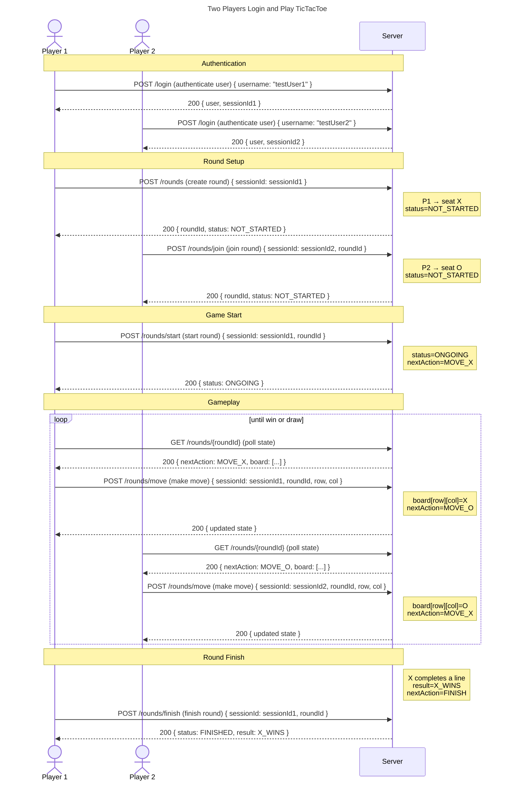

```mermaid
sequenceDiagram
    title Two Players Login and Play TicTacToe

    actor P1 as Player 1
    actor P2 as Player 2
    participant S as Server

    Note over P1,S: Authentication

    P1->>S: POST /login (authenticate user) { username: "testUser1" }
    S-->>P1: 200 { user, sessionId1 }

    P2->>S: POST /login (authenticate user) { username: "testUser2" }
    S-->>P2: 200 { user, sessionId2 }

    Note over P1,S: Round Setup

    P1->>S: POST /rounds (create round) { sessionId: sessionId1 }
    Note right of S: P1 → seat X<br/>status=NOT_STARTED
    S-->>P1: 200 { roundId, status: NOT_STARTED }

    P2->>S: POST /rounds/join (join round) { sessionId: sessionId2, roundId }
    Note right of S: P2 → seat O<br/>status=NOT_STARTED
    S-->>P2: 200 { roundId, status: NOT_STARTED }

    Note over P1,S: Game Start

    P1->>S: POST /rounds/start (start round) { sessionId: sessionId1, roundId }
    Note right of S: status=ONGOING<br/>nextAction=MOVE_X
    S-->>P1: 200 { status: ONGOING }

    Note over P1,S: Gameplay

    loop until win or draw
        P1->>S: GET /rounds/{roundId} (poll state)
        S-->>P1: 200 { nextAction: MOVE_X, board: [...] }

        P1->>S: POST /rounds/move (make move) { sessionId: sessionId1, roundId, row, col }
        Note right of S: board[row][col]=X<br/>nextAction=MOVE_O
        S-->>P1: 200 { updated state }

        P2->>S: GET /rounds/{roundId} (poll state)
        S-->>P2: 200 { nextAction: MOVE_O, board: [...] }

        P2->>S: POST /rounds/move (make move) { sessionId: sessionId2, roundId, row, col }
        Note right of S: board[row][col]=O<br/>nextAction=MOVE_X
        S-->>P2: 200 { updated state }
    end

    Note over P1,S: Round Finish

    Note right of S: X completes a line<br/>result=X_WINS<br/>nextAction=FINISH
    P1->>S: POST /rounds/finish (finish round) { sessionId: sessionId1, roundId }
    S-->>P1: 200 { status: FINISHED, result: X_WINS }
```